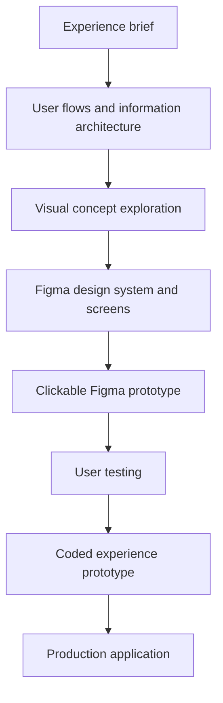

## Workflow Order

I don't recommend designing the app by asking an image generator to design the entire application. It can produce beautiful screens without coherent navigation, reusable components, accessibility, or realistic player states. Use it to discover the app’s visual identity after you understand the experience.

## Recommended workflow

| Phase        | What to do                                                  | Tools                                   | Deliverable                          |
| ------------ | ----------------------------------------------------------- | --------------------------------------- | ------------------------------------ |
| 1. Define    | Decide who, when, and why the app serves                    | Notion, Markdown, FigJam                | One-page experience brief            |
| 2. Structure | Design navigation and listening flows                       | FigJam or Figma                         | Sitemap, user flows, wireframes      |
| 3. Explore   | Generate several distinct visual directions                 | ChatGPT Images, Midjourney, mood boards | Three concept boards                 |
| 4. Design    | Turn the selected direction into a consistent interface     | Figma                                   | High-fidelity screens and components |
| 5. Simulate  | Connect screens and reproduce important states              | Figma prototype                         | Clickable prototype                  |
| 6. Validate  | Observe people performing realistic tasks                   | Figma, screen recording                 | Findings and revised design          |
| 7. Prove     | Implement interactions that Figma cannot realistically test | React/Vite and real audio files         | Coded UX prototype                   |
| 8. Build     | Design the real architecture and backend                    | React + ASP.NET Core, for example       | Production application               |

Figma is appropriate for wireframing, detailed UI design, component systems, collaboration, and testing interactive designs before implementation. [Figma’s documentation](https://help.figma.com/hc/en-us/categories/360002772634-Community)

### 1. Write a one-page experience brief

Keep this deliberately small. Define:

* Target user: someone working, studying, reading, coding, or relaxing.
* Main promise: “Start suitable background music with almost no decision-making.”
* Main context: desktop during long sessions, with mobile as a secondary context.
* Emotional qualities: calm, immersive, warm, futuristic, nocturnal, or something else.
* Business scope: curated playlists, not a full Spotify replacement.
* Success criteria:

  * Music can start within roughly 10 seconds.
  * Switching genres does not interrupt the user unnecessarily.
  * The currently playing state is always obvious.
  * The interface does not compete with work for attention.

Choose three or four design principles, such as:

1. Music first, interface second.
2. Discovery without decision fatigue.
3. Atmospheric but readable.
4. Familiar playback controls inside an original visual world.

### 2. Define the MVP experience

Before visual design, decide what the prototype needs to demonstrate.

A sensible first scope is:

* Home/discovery screen
* Genre or mood selection
* Playlist view
* Persistent player
* Play/pause, previous/next, seek, volume
* Current queue
* A distraction-free “focus mode”
* Responsive desktop and mobile layouts
* Loading, unavailable-track, empty and playback-error states

Defer accounts, recommendations, social features, uploads, payments, and complex playlist management.

Create flows for five important tasks:

* Start listening immediately.
* Choose a genre.
* Change to another playlist.
* Inspect or change the queue.
* Return to the app and understand what is currently playing.

### 3. Make low-fidelity wireframes

Use grayscale Figma frames without album art, gradients, animations, or polished typography. Concentrate on:

* Where playback controls live
* Whether the player is always visible
* How genres and playlists relate
* How much information is shown per track
* What happens when a user opens the queue
* Desktop-to-mobile behavior
* Keyboard focus order

Create two or three structural alternatives. For example:

* Dashboard with persistent bottom player
* Full-screen immersive player with an expandable library
* Split layout: navigation, playlist and atmospheric player

Select the structure before investing in visual polish.

### 4. Explore three genuinely different visual directions

Now use an image generator. Give each direction a name and a clear design thesis rather than generating random screens.

Possible directions for your app:

| Direction         | Character                                                                      |
| ----------------- | ------------------------------------------------------------------------------ |
| Nocturnal Radio   | Dark editorial layout, analog equipment cues, subtle grain, warm accent lights |
| Living Soundscape | Generative landscapes, slowly changing color fields, minimal floating controls |
| Spatial Studio    | Geometric depth, glass and layered space, restrained futuristic typography     |

Generate:

* Home screen
* Full player
* Playlist view
* Mobile player
* Genre artwork or background system

A useful prompt structure:

> Design a desktop music web application for curated background music. The primary activity is starting a genre playlist quickly while working. Create a calm, nocturnal visual identity influenced by analog radio equipment and contemporary editorial design. Include a persistent player, genre navigation, playlist tracks and queue access. Avoid copying Spotify, Apple Music or YouTube Music. Use realistic content and preserve familiar playback-control conventions.

Judge concepts using a scorecard:

* Distinctiveness
* Suitability for long listening sessions
* Readability
* Feasibility in CSS
* Responsiveness
* Consistency across screens
* Accessibility
* Ability to become a recognizable brand

Use generated screens as art direction—not as implementation specifications.

### 5. Build the design system in Figma

Reconstruct the chosen direction intentionally in Figma. Do not simply trace an image-generated screen.

Define:

* Color tokens, including surface hierarchy
* Typography scale
* Spacing and radius tokens
* Grid and responsive breakpoints
* Icons
* Buttons and controls
* Track rows
* Playlist and genre cards
* Player variants
* Hover, focus, pressed, disabled and loading states
* Motion principles
* Artwork treatment

The unique identity should come mainly from artwork, composition, typography, motion and environmental effects. Playback controls should remain recognizable.

Design with real playlist names, long track titles, missing artwork and different languages. Placeholder-perfect content hides layout problems.

### 6. Create and test the clickable prototype

Connect the important Figma flows and test them with approximately five people resembling your intended users.

Give them tasks instead of instructions:

* “You’re beginning a two-hour coding session. Start suitable music.”
* “Change from Lo-Fi Beats to Future Garage.”
* “Remove an unwanted track from what plays next.”
* “Reduce visual distractions while keeping the music playing.”

Measure:

* Time to first playback
* Wrong clicks or hesitation
* Whether playback status is understood
* Whether users can locate volume and queue
* Whether the interface feels distracting
* Which design elements they remember afterward

Revise the flow before writing substantial code.

### 7. Build a coded experience prototype

This is where you test everything Figma handles poorly:

* Real audio playback
* Browser autoplay restrictions
* Seeking and buffering
* Volume behavior
* Animated backgrounds
* Crossfades
* Responsive layout
* Keyboard shortcuts
* Performance on an older device
* Reduced-motion mode
* Error recovery

For you, I would use:

* React with Vite
* Plain CSS, CSS Modules, or Tailwind—whichever you expect to keep
* Native `HTMLAudioElement` initially
* Static JSON playlist data
* Local or legally usable sample audio
* No authentication
* No database
* No production backend

Avoid a completely disposable HTML/CSS/JS implementation if React will be your eventual frontend. Build a narrow vertical slice that can later become the real UI.

Because this is an audio product, check keyboard operation, visible focus, contrast, understandable button labels, and reduced motion from the beginning. The [W3C Web Accessibility Initiative](https://www.w3.org/WAI/) provides the relevant accessibility foundation.

### 8. Establish the production gate

Begin real development only when you have:

* A tested primary navigation model
* Approved desktop and mobile screens
* Defined design tokens and components
* All important player states
* Proven real-audio behavior
* Basic accessibility validation
* A short list of deferred features
* A UI acceptance checklist

## Suggested four-week schedule

* Week 1: experience brief, references, flows and wireframes
* Week 2: image-generated concept exploration and design selection
* Week 3: Figma system, high-fidelity screens and user testing
* Week 4: coded audio prototype, accessibility and performance validation

The main rule is: **validate UX cheaply in Figma, but validate the listening experience in code**. Sound, buffering, animation and long-session comfort cannot be judged reliably from static mockups.
