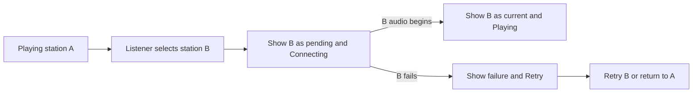

# Phase 2 specification: user flows and information architecture

**Status:** Structure proposal for low-fidelity review  
**Basis:** [Design workflow](./00-design-workflow.md), [Phase 1 experience brief](./01-experience-brief.md), and the channel-tune-in model described in [DI.FM's help](https://www.di.fm/contact) and [persistent-player announcement](https://www.di.fm/content/digitally-imported-revamps-user-experience-and-launches-exclusive-dj-series-on-its-award-winning-electronic-music-radio-platform)

## Purpose and source priority

This phase defines what a listener can reach, how listening begins and changes, and where controls live. It is deliberately grayscale and content-first; visual identity belongs to Phase 3.

The Phase 1 brief is the product scope for this phase. The workflow's playlist, track, seek, skip, and editable-queue examples describe a broader possible music product. Phase 1 launches with **two continuous stations**, Future Garage and Lo-Fi Beats, and allows the station list to grow to **10 or more** later. Accordingly, this specification has no playlist, track-list, queue, seek, or skip flow. The five primary tasks below are adapted to radio listening. DI.FM is a reference for choosing a channel and keeping a player available while browsing, not for its account, trial, premium, content, or visual design.

## Experience to structure

The first screen answers two questions: **“What can I play?”** and **“What is playing now?”** The first station choices and current status are visible without scrolling on a typical desktop screen. A listener can Tune In to a station through one explicit action, then leave the tab alone. The active station and playback state remain visible whenever the app is open. Tuning In to another station is the same action, with clear feedback during connection. If the station list exceeds its available space, the listener can scroll that list without moving the player.

### Terms

| Term | Meaning in this product |
| --- | --- |
| Station | One continuous curated radio stream. Future Garage and Lo-Fi Beats are the two launch stations; the chooser must also work with 10 or more stations. |
| Tune In | Request a station and start its stream after a user action, whether nothing is playing or another station is active. It does not start a track from its beginning. |
| Current station | The station being heard, or the last station selected when playback is paused or interrupted. |
| On air | A status used only when that station's audio is being heard. |
| Pending station | A different station requested while its stream is connecting. It is not labeled “playing” before audio starts. |
| Player | The persistent area showing current station artwork beside its name and state, play/pause, volume/mute, and any needed recovery action. |

### In and out of scope

| Included in this phase | Excluded from the first release |
| --- | --- |
| Two stations at launch; a station chooser and card layout that work with 10 or more; square station artwork; one Tune In action on station cards; persistent player; play/pause; volume/mute; clear loading, buffering, unavailable, and error states; desktop and mobile layouts | Focus View; accounts; onboarding; recommendations; additional stations in the first release; playlist and track pages; track-level actions; queue; seek; skip; previous/next; sharing; payments; uploads |

Current-track metadata is optional supporting information when a reliable source exists. It never displaces the station name or playback state, and its absence creates no empty track panel.

## Information architecture

```text
Listen  /  (the only primary destination)
├── Station chooser (scrolls vertically only when cards overflow)
│   ├── Future Garage card + square artwork → Tune In
│   ├── Lo-Fi Beats card + square artwork   → Tune In
│   └── More station cards when the catalog grows (10+ total)
└── Persistent player
    ├── Current station artwork + name + playback status
    ├── Play / Pause
    ├── Volume / Mute
    └── Retry, when a stream fails
```

There is no separate station detail page. The same card pattern repeats for every station, whether there are two or 10 or more. Every card contains square artwork, a station name, and a short description. **Tune In** is the only station-card action, for both starting playback and changing stations; its name is accessible but is not printed on the card. The current card shows a status label instead of a redundant Tune In action. The player repeats that station's square artwork immediately beside its name and playback status, using the same source image at a smaller size. If an image is unavailable, a square fallback occupies the same space.

### Navigation and orientation rules

1. Opening `/` shows both stations and the player in its idle state. No stream starts on page load.
2. The player stays visible while choosing and scrolling stations. It shows current station artwork, name, and an unambiguous text status alongside any icon or motion.
3. One station can be on air at a time. The chooser marks the current station and shows **On air** only while its audio is heard. During a switch, it also marks the pending destination separately.
4. Noncurrent station cards offer Tune In through the card surface, without a separately labeled button. The current station card remains identifiable but does not invite a redundant retune, whether playing or paused. The player provides pause and resume.
5. Returning to an open tab shows the actual current state. After a reload, the app remembers the last station as a convenience, but playback waits for another explicit action.

## Structural alternatives for grayscale wireframes

| Option | Rough structure | Strength | Cost |
| --- | --- | --- | --- |
| **A. Scrollable chooser with persistent bottom player** | Station cards in the main area; compact player anchored at the bottom | Both choices and playback state remain easy to find; station area can grow without moving the player | Bottom player uses some vertical space |
| B. Station rail with side player | Vertically scrolling station rail beside a large player | Strong desktop overview | Crowded on smaller screens; disproportionate for two launch stations |
| C. Top player with station list below | Player anchored above a vertically scrolling station list | Playback controls appear early in reading order | Station choices start lower on mobile, slowing first tune-in |

**Proposed structure: A.** It best fits the roughly ten-second first-audio target with two launch stations and can scale to 10 or more through the scrollable chooser. Validate it with both two-card and 12-card grayscale frames before visual exploration; if users miss station switching or cannot find a station below the fold, revise the structure.

### Station card behavior

- Each card has a **square artwork area** that keeps its shape at every responsive size. The artwork is decorative beside the visible station name; missing artwork uses a same-size fallback. Do not use DI.FM's artwork or branding.
- The whole available card surface is the Tune In target for a station that is not current. No action text is printed on the card; its accessible action name is **“Tune In to Future Garage”** or **“Tune In to Lo-Fi Beats”**. The current card shows its status and is not another playback action; resume remains in the player.
- Hovering an actionable card smoothly enlarges it slightly (target scale about **1.02** over **180–220 ms**) and may strengthen its outline or shadow. The motion is an invitation to Tune In; it never starts playback on hover. It must not cover neighboring cards, the scrollbar, or the player. The current card does not enlarge because activating it would do nothing.
- Keyboard focus gets an equally clear visible affordance, without requiring hover. On touch devices there is no hover-only information. Pressing Enter or Space activates the card. With reduced motion enabled, use an immediate outline or contrast change instead of scaling.

### Station-area scrollbar behavior

The station chooser has a bounded area between the heading and persistent player. On desktop it uses a repeating card grid; on narrow screens it uses one column. The layout must accept 10 or more station records without adding a new page or changing the player. **Only this area scrolls vertically** when cards do not fit. Do not create a horizontal scrollbar. Keep the header and player in view while the station cards scroll.

- When every card fits, show **no scrollbar or empty track**.
- When cards exceed the available height, show a visible vertical scrollbar **inside the chooser's right edge**, with a track and draggable thumb. Reserve space so it never covers artwork, labels, or card hover growth. Its thumb should indicate how much of the list is visible. This visible affordance is required even on systems that normally auto-hide overlay scrollbars.
- Support mouse wheel, trackpad, dragging the thumb, keyboard scrolling, and touch swipes. Tab navigation through cards scrolls the focused card into view. The scrollbar itself can be operated by pointer; keyboard users can scroll the region without a pointer.
- The player and its artwork do not move as the list scrolls. Tuning In to another station keeps the list at its current scroll position unless needed to reveal the new current card. Changing viewport size recalculates whether the scrollbar is needed.

## Five primary user flows

| Task | Entry and actions | Expected result | Recovery or edge case |
| --- | --- | --- | --- |
| 1. Start listening | Open Listen → Tune In through a station card (Future Garage or Lo-Fi Beats at launch) | Chosen card and player say **Connecting**, then **Playing** when audio starts; its artwork appears beside player status | If connection fails, show **Unavailable** with **Retry** and leave other available stations selectable; never claim playback before audio begins |
| 2. Choose a different station | While a station is playing or paused → Tune In through any other station card | Destination becomes pending immediately; player announces the change; current-station label and artwork change only when new audio is available | If the new stream fails, show the failure and allow retry or return to the prior station; avoid a silent, unexplained state |
| 3. Pause and resume | Activate **Pause** in the player → later activate **Play** | Paused and playing states are visually and textually distinct; station stays selected | If resuming needs a new connection, show **Connecting** or **Buffering** until audio is heard |
| 4. Adjust sound and return to work | Use volume control or **Mute** → leave the tab → return | Sound change is immediate; returning tab still shows the station and actual state | A system or browser interruption updates the state; do not show **Playing** if audio has stopped |
| 5. Browse an overflowing station list | With a 10+ station catalog → scroll the chooser → Tune In through a card below the fold | Scrollbar is visible; cards move within the chooser without interrupting audio; player remains visible; the station change then follows flow 2 | Keyboard and touch can reach the same card; resizing to a fully fitting list removes the scrollbar |

The workflow's example task “inspect or change the queue” does not apply to continuous radio. Flow 5 checks that an expanded station collection remains navigable without interrupting listening.

### Tuning In while another station plays



Do not promise a seamless audio crossfade at this phase. The preferred experience is to keep A audible until B is ready if the eventual audio approach permits it; the coded prototype must test whether this is feasible. If a short gap occurs, the UI still explains that B is connecting. The interface must never show both stations as **Playing**.

## Low-fidelity wireframe content

These blocks specify placement and labels, not typography, artwork style, or color. `□` represents a square artwork image or its fallback. In Figma, make separate grayscale frames for default desktop and mobile views, the visible-scrollbar case, hover/focus, and the state variations below. Build alternatives B and C at rough fidelity before selecting A for detailed work.

### A1. Desktop Listen, idle

```text
┌──────────────────────────────────────────────────────────────┐
│ App name                                                     │
├──────────────────────────────────────────────────────────────┤
│ Pick a station                                               │
│ Continuous music for your work session.                      │
│                                                              │
│ ┌─────────────────────────┐  ┌─────────────────────────┐     │
│ │ □  Future Garage        │  │ □  Lo-Fi Beats          │     │
│ │    Atmospheric, rhythmic│  │    Warm, steady         │     │
│ └─────────────────────────┘  └─────────────────────────┘     │
│                                                              │
├──────────────────────────────────────────────────────────────┤
│ Nothing playing                 Volume [────●──] [Mute]      │
└──────────────────────────────────────────────────────────────┘
```

### A2. Desktop Listen, playing or switching

```text
┌──────────────────────────────────────────────────────────────┐
│ App name                                                     │
├──────────────────────────────────────────────────────────────┤
│ Pick a station                                               │
│                                                              │
│ ┌─────────────────────────┐  ┌─────────────────────────┐     │
│ │ □  Future Garage        │  │ □  Lo-Fi Beats          │     │
│ │    On air               │  │    Warm, steady         │     │
│ └─────────────────────────┘  └─────────────────────────┘     │
│                                                              │
├──────────────────────────────────────────────────────────────┤
│ □ Future Garage · Playing [Pause] Volume [──●────] [Mute]    │
└──────────────────────────────────────────────────────────────┘
```

The idle volume control may set a starting level before playback. When switching, the destination card reads **Connecting**, while the player identifies both the current station and the pending destination (for example, “Future Garage playing · Connecting to Lo-Fi Beats”). Once the new audio begins, both surfaces change together. If switching interrupts the old audio, the status says that connection is in progress rather than implying sound is still heard.

### A3. Desktop Listen, 12-station overflow case

```text
┌──────────────────────────────────────────────────────────────┐
│ App name                                                     │
├──────────────────────────────────────────────────────────────┤
│ Pick a station                                               │
│ ┌─────────────────────────┐  ┌─────────────────────────┐ ┌─┐ │
│ │ □  Future Garage        │  │ □  Lo-Fi Beats          │ │█│ │
│ │    On air               │  │    Warm, steady         │ │█│ │
│ └─────────────────────────┘  └─────────────────────────┘ │█│ │
│ ┌─────────────────────────┐  ┌─────────────────────────┐ │░│ │
│ │ □  Additional station A │  │ □  Additional station B │ │░│ │
│ └─────────────────────────┘  └─────────────────────────┘ └─┘ │
│       8 more cards below; only this station area scrolls     │
├──────────────────────────────────────────────────────────────┤
│ □ Future Garage · Playing [Pause] Volume [──●────] [Mute]    │
└──────────────────────────────────────────────────────────────┘
```

The right-edge track and thumb appear only because the cards overflow. The 12-card frame represents a later catalog, not the first-release catalog. The same scrollbar rule applies if even two cards overflow a short viewport.

### A4. Mobile Listen, playing

```text
┌──────────────────────────┐
│ App name                 │
├──────────────────────────┤
│ Pick a station           │
│ ┌──────────────────────┐ │
│ │ □  Future Garage     │ │
│ │    On air            │ │
│ └──────────────────────┘ │
│ ┌──────────────────────┐ │
│ │ □  Lo-Fi Beats       │ │
│ │    Warm, steady      │ │
│ └──────────────────────┘ │
├──────────────────────────┤
│ □ Future Garage · Playing│
│ [Pause] [Mute] [Volume]  │
└──────────────────────────┘
```

On narrow screens, the player is a compact persistent bar with square artwork, station, state, play/pause, and mute. Its **Volume** control opens within the player or an accessible small panel; a listener does not need to navigate away to adjust it. The chooser remains directly above the bar and scrolls vertically when needed, with its scrollbar on the right edge.

### State variants to draw on the selected structure

| State | Required visible content and action |
| --- | --- |
| Idle | Every available station card offers Tune In with no action text printed on it; player says **Nothing playing** and shows no station artwork. |
| Connecting | Requested card and player show **Connecting**; player shows that station's square artwork; prevent duplicate requests. |
| Playing | Current card says **On air**; player shows matching artwork, **Playing**, **Pause**, volume and mute. |
| Paused | Player keeps current artwork and says **Paused**, with **Play**, volume and mute; card has no **On air** label. |
| Buffering | Player keeps current artwork and says **Buffering**; no false playing indicator. |
| Station unavailable | Name the affected station, say **Unavailable**, offer **Retry** and keep other available stations selectable. |
| Station chooser empty | Explain that stations could not load and offer **Retry**; do not show an empty page as if there are no stations by design. |
| Playback error | Short plain-language message, **Retry**, and an unaffected station choice. |
| Chooser overflow | Show the right-edge scrollbar and keep the player fixed; remove the scrollbar when all cards fit. |
| Card hover/focus | A card offering Tune In grows slightly on hover; keyboard focus has an equivalent visible cue. The current card does not suggest another action. |

If metadata is present, test long titles, different languages, and missing metadata in the player. Station artwork, name, and state must remain readable in every case.

## Interaction and accessibility requirements

- Make each card offering Tune In a keyboard-operable control with a visible focus indicator and an accessible name that includes **Tune In** and the station name. The action text may be visually omitted, but the station name remains visible. Do not make the card an unlabeled hit target.
- Keep keyboard order aligned with reading order: station cards, then player controls. Moving through an overflowing chooser brings the focused card into view without moving the player.
- Announce meaningful state changes such as connecting, playing, paused, and failure without repeatedly announcing routine metadata changes. A status region should not flood assistive technology during buffering.
- Do not use color, animation, or artwork alone to indicate on-air, pending, muted, or unavailable states. Card hover motion respects reduced-motion preference and has a non-motion focus equivalent.
- Preserve usable player controls at desktop and mobile sizes, including zoomed layouts. A mobile listener should be able to pause without opening another screen.
- Playback starts only from an explicit user action. Page load and tab return do not initiate audio.

## Phase 2 review and exit criteria

Create grayscale Figma frames from the layouts and state variants above. Test them with the five task prompts in this document before Phase 3 visual exploration. The structural choice is ready to advance when participants can:

1. Find and start either station without instruction, with a plausible path to first audio in roughly ten seconds.
2. Tell which station is actually on air, which is pending, and whether audio is playing, paused, connecting, or unavailable.
3. Switch stations and recover from a failed switch without looking for a queue or track list.
4. Find play/pause and sound controls on desktop and mobile, and recognize the current station from its artwork, name, and status.
5. With 12 stations on desktop and mobile, reach and activate a station below the fold by pointer, keyboard, and touch without losing the player; see no scrollbar when the cards fit.
6. Return after leaving the tab and understand the current state at a glance.

Record hesitation, wrong clicks, and any status language that users misunderstand. Revise the navigation and wireframes before making high-fidelity screens. Real stream timing, browser audio restrictions, buffering, and the preferred switch handoff remain Phase 7 coded-prototype questions; the wireframes define the feedback users need in those cases.
