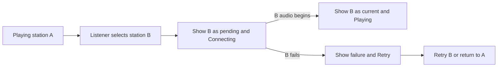

# Phase 2 specification: user flows and information architecture

**Status:** Structure proposal for low-fidelity review  
**Basis:** [Design workflow](./00-design-workflow.md), [Phase 1 experience brief](./01-experience-brief.md), and the channel-tune-in model described in [DI.FM's help](https://www.di.fm/contact) and [persistent-player announcement](https://www.di.fm/content/digitally-imported-revamps-user-experience-and-launches-exclusive-dj-series-on-its-award-winning-electronic-music-radio-platform)

## Purpose and source priority

This phase defines what a listener can reach, how listening begins and changes, and where controls live. It is deliberately grayscale and content-first; visual identity belongs to Phase 3.

The Phase 1 brief is the product scope for this phase. The workflow's playlist, track, seek, skip, and editable-queue examples describe a broader possible music product. Phase 1 explicitly replaces those with **two continuous stations**: Future Garage and Lo-Fi Beats. Accordingly, this specification has no playlist, track-list, queue, seek, or skip flow. The five primary tasks below are adapted to radio listening. DI.FM is a reference for choosing a channel and keeping a player available while browsing, not for its account, trial, premium, content, or visual design.

## Experience to structure

The first screen answers two questions without scrolling: **“What can I play?”** and **“What is playing now?”** A listener can start either station through one explicit action, then leave the tab alone. The active station and playback state remain visible whenever the app is open. Switching stations is a direct action, with clear feedback during connection.

### Terms

| Term | Meaning in this product |
| --- | --- |
| Station | One continuous curated radio stream. Only Future Garage and Lo-Fi Beats exist in the first release. |
| Tune in | Request a station and start its stream after a user action. It does not start a track from its beginning. |
| Current station | The station being heard, or the last station selected when playback is paused or interrupted. |
| On air | A status used only when that station's audio is being heard. |
| Pending station | A different station requested while its stream is connecting. It is not labeled “playing” before audio starts. |
| Player | The persistent area showing current station, state, play/pause, volume/mute, and any needed recovery action. |

### In and out of scope

| Included in this phase | Excluded from the first release |
| --- | --- |
| Two-station chooser; direct tune-in and switch; persistent player; play/pause; volume/mute; clear loading, buffering, unavailable, and error states; compact focus view; desktop and mobile layouts | Accounts; onboarding; recommendations; other genres; playlist and track pages; track-level actions; queue; seek; skip; previous/next; sharing; payments; uploads |

Current-track metadata is optional supporting information when a reliable source exists. It never displaces the station name or playback state, and its absence creates no empty track panel.

## Information architecture

```text
Listen  /  (the only primary destination)
├── Station chooser
│   ├── Future Garage  → Tune in / Switch to
│   └── Lo-Fi Beats    → Tune in / Switch to
├── Persistent player
│   ├── Current station and playback status
│   ├── Play / Pause
│   ├── Volume / Mute
│   └── Retry, when a stream fails
└── Focus view  (a reversible view of Listen, not a new listening session)
    ├── Current station and playback status
    ├── Play / Pause
    ├── Volume / Mute
    └── Exit focus view
```

There is no separate station detail page: two choices can be understood and acted on in one view. A station card describes the station's feel in one short line and has an explicit **Tune in** action. After listening starts, the other card offers **Switch to**. The current card shows a status label rather than a second play action; the player provides resume when paused. The focus view is available after a station is selected. It hides the chooser until exited, but keeps essential playback controls visible and never changes audio by itself.

### Navigation and orientation rules

1. Opening `/` shows both stations and the player in its idle state. No stream starts on page load.
2. The player stays visible while choosing stations and while the page scrolls. It shows the current station and an unambiguous text status alongside any icon or motion.
3. One station can be on air at a time. The chooser marks the current station and shows **On air** only while its audio is heard. During a switch, it also marks the pending destination separately.
4. Closing focus view returns to the chooser with the same station and playback state. Browser Back must not pause audio or create a second playback session.
5. Returning to an open tab shows the actual current state. After a reload, the app remembers the last station as a convenience, but playback waits for another explicit action.

## Structural alternatives for grayscale wireframes

| Option | Rough structure | Strength | Cost |
| --- | --- | --- | --- |
| **A. Chooser with persistent bottom player** | Two station choices in the main area; compact player anchored at the bottom | Both choices and playback state remain easy to find; adapts to a single mobile column | Bottom player uses some vertical space |
| B. Full-screen station player with expandable chooser | Large current-station view; stations behind a menu or drawer | Very quiet after starting | Adds a step before first tune-in and makes switching less visible |
| C. Split station rail and player | Choices in a side rail; large player alongside | Strong desktop overview | Crowded on smaller screens; oversized for two stations |

**Proposed structure: A.** It best fits the roughly ten-second first-audio target and two-station scope. A lightweight focus view supplies the quieter state that option B offers after playback starts. Validate this choice with grayscale frames before visual exploration; if users repeatedly seek a larger player or miss station switching, revise the structure.

## Five primary user flows

| Task | Entry and actions | Expected result | Recovery or edge case |
| --- | --- | --- | --- |
| 1. Start listening | Open Listen → choose Future Garage or Lo-Fi Beats → activate **Tune in** | Chosen card and player say **Connecting**, then **Playing** when audio starts | If connection fails, show **Unavailable** with **Retry** and leave the other station available; never claim playback before audio begins |
| 2. Choose a different station | While a station is playing or paused → activate **Switch to** on the other card | Destination becomes pending immediately; player announces the switch; current-station label changes only when new audio is available | If the new stream fails, show the failure and allow retry or return to the prior station; avoid a silent, unexplained state |
| 3. Pause and resume | Activate **Pause** in the player → later activate **Play** | Paused and playing states are visually and textually distinct; station stays selected | If resuming needs a new connection, show **Connecting** or **Buffering** until audio is heard |
| 4. Adjust sound and return to work | Use volume control or **Mute** → leave the tab → return | Sound change is immediate; returning tab still shows the station and actual state | A system or browser interruption updates the state; do not show **Playing** if audio has stopped |
| 5. Reduce visual distraction | While listening → open **Focus view** → later exit it | Chooser is hidden, player controls and status remain; audio continues through both view changes | If a stream stalls in focus view, status and retry remain available there |

The workflow's example task “inspect or change the queue” does not apply to continuous radio. Flow 5 checks the brief's long-session, low-distraction promise in its place.

### Switch flow detail



Do not promise a seamless audio crossfade at this phase. The preferred experience is to keep A audible until B is ready if the eventual audio approach permits it; the coded prototype must test whether this is feasible. If a short gap occurs, the UI still explains that B is connecting. The interface must never show both stations as **Playing**.

## Low-fidelity wireframe content

These blocks specify placement and labels, not typography, artwork, color, or dimensions. In Figma, make separate grayscale frames for the default desktop and mobile views, a focus view, and the state variations below. Build frames for alternatives B and C at rough fidelity before selecting A for detailed work.

### A1. Desktop Listen, idle

```text
┌──────────────────────────────────────────────────────────────┐
│ App name                             Focus view (unavailable) │
├──────────────────────────────────────────────────────────────┤
│ Pick a station                                               │
│ Continuous music for your work session.                      │
│                                                              │
│ ┌─────────────────────────┐  ┌─────────────────────────┐     │
│ │ Future Garage           │  │ Lo-Fi Beats             │     │
│ │ Atmospheric, rhythmic   │  │ Warm, steady            │     │
│ │ [Tune in]               │  │ [Tune in]               │     │
│ └─────────────────────────┘  └─────────────────────────┘     │
│                                                              │
├──────────────────────────────────────────────────────────────┤
│ Nothing playing                 Volume [────●──] [Mute]      │
└──────────────────────────────────────────────────────────────┘
```

### A2. Desktop Listen, playing or switching

```text
┌──────────────────────────────────────────────────────────────┐
│ App name                                      [Focus view]    │
├──────────────────────────────────────────────────────────────┤
│ Pick a station                                               │
│                                                              │
│ ┌─────────────────────────┐  ┌─────────────────────────┐     │
│ │ Future Garage           │  │ Lo-Fi Beats             │     │
│ │ On air                  │  │ [Switch to]             │     │
│ └─────────────────────────┘  └─────────────────────────┘     │
│                                                              │
├──────────────────────────────────────────────────────────────┤
│ Future Garage · Playing   [Pause]  Volume [──●────] [Mute]   │
└──────────────────────────────────────────────────────────────┘
```

The idle volume control may set a starting level before playback. When switching, the destination card reads **Connecting**, while the player identifies both the current station and the pending destination (for example, “Future Garage playing · Connecting to Lo-Fi Beats”). Once the new audio begins, both surfaces change together. If switching interrupts the old audio, the status says that connection is in progress rather than implying sound is still heard.

### A3. Mobile Listen and focus view

```text
LISTEN                               FOCUS VIEW
┌──────────────────────────┐         ┌──────────────────────────┐
│ App name    [Focus view] │         │ [Back to stations]       │
├──────────────────────────┤         ├──────────────────────────┤
│ Pick a station           │         │ Future Garage            │
│ ┌──────────────────────┐ │         │ Playing                  │
│ │ Future Garage        │ │         │                          │
│ │ [Tune in] / On air   │ │         │ [Pause]                  │
│ └──────────────────────┘ │         │ Volume [──●────] [Mute]  │
│ ┌──────────────────────┐ │         │                          │
│ │ Lo-Fi Beats          │ │         │                          │
│ │ [Tune in / Switch to]│ │         │                          │
│ └──────────────────────┘ │         │                          │
├──────────────────────────┤         └──────────────────────────┘
│ Station · State [Play/   │
│ Pause] [Mute]            │
└──────────────────────────┘
```

On narrow screens, the player is a compact persistent bar with station, state, play/pause, and mute. Its **Volume** control opens within the player or an accessible small panel; a listener does not need to navigate away to adjust it. The chooser remains directly above the bar. The focus view shows the volume control without hiding basic playback.

### State variants to draw on the selected structure

| State | Required visible content and action |
| --- | --- |
| Idle | Both **Tune in** actions; player says **Nothing playing**. |
| Connecting | Requested station and **Connecting**; prevent duplicate tune-in requests. |
| Playing | On-air station, **Playing**, **Pause**, volume and mute. |
| Paused | Current station, **Paused**, **Play**, volume and mute; no **On air** label. |
| Buffering | Current station and **Buffering**; no false playing indicator. |
| Station unavailable | Name the affected station, say **Unavailable**, offer **Retry** and the other station. |
| Station chooser empty | Explain that stations could not load and offer **Retry**; do not show an empty page as if there are no stations by design. |
| Playback error | Short plain-language message, **Retry**, and an unaffected station choice. |

If metadata is present, test long titles, different languages, and missing metadata in the player. Station and state must remain readable in every case.

## Interaction and accessibility requirements

- Treat each station action, player action, and focus control as a real keyboard-operable control with a visible focus indicator and a clear label. Do not make an entire card the only unlabeled hit target.
- Keep keyboard order aligned with reading order: app/focus control, station choices, then player controls. When focus view opens, move focus to its heading or first control; on exit, return focus to the opener.
- Announce meaningful state changes such as connecting, playing, paused, and failure without repeatedly announcing routine metadata changes. A status region should not flood assistive technology during buffering.
- Do not use color, animation, or artwork alone to indicate on-air, pending, muted, or unavailable states. Motion is optional and respects reduced-motion preference.
- Preserve usable player controls at desktop and mobile sizes, including zoomed layouts. A mobile listener should be able to pause without opening another screen.
- Playback starts only from an explicit user action. Page load, tab return, opening focus view, and closing focus view do not initiate audio.

## Phase 2 review and exit criteria

Create grayscale Figma frames from the layouts and state variants above. Test them with the five task prompts in this document before Phase 3 visual exploration. The structural choice is ready to advance when participants can:

1. Find and start either station without instruction, with a plausible path to first audio in roughly ten seconds.
2. Tell which station is actually on air, which is pending, and whether audio is playing, paused, connecting, or unavailable.
3. Switch stations and recover from a failed switch without looking for a queue or track list.
4. Find play/pause and sound controls on desktop and mobile, including focus view.
5. Return after leaving the tab and understand the current state at a glance.

Record hesitation, wrong clicks, and any status language that users misunderstand. Revise the navigation and wireframes before making high-fidelity screens. Real stream timing, browser audio restrictions, buffering, and the preferred switch handoff remain Phase 7 coded-prototype questions; the wireframes define the feedback users need in those cases.
